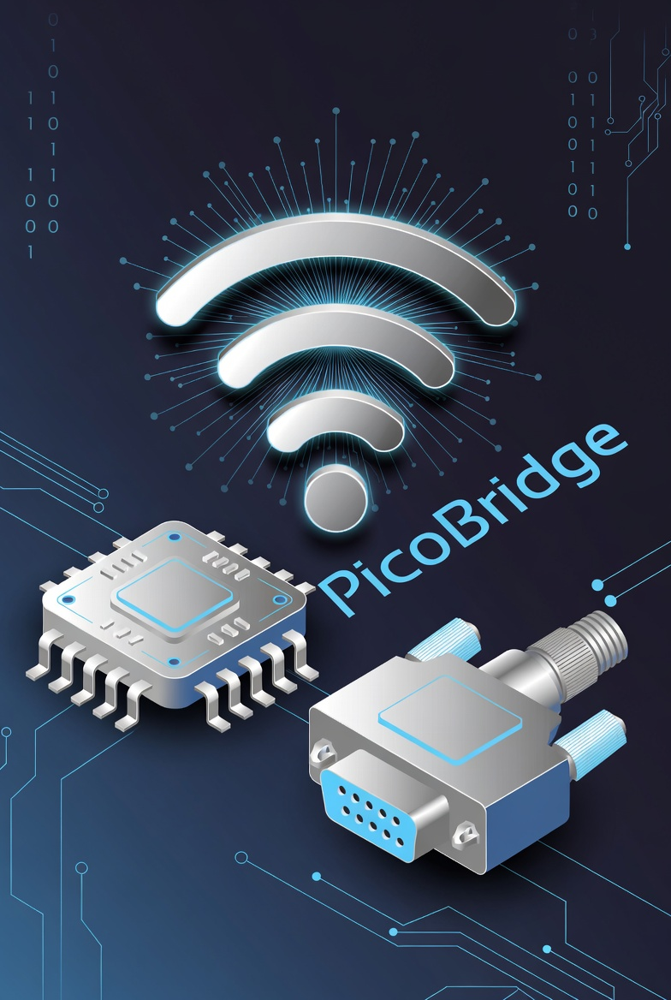

# PicoBridge

**PicoBridge** is a Wi-Fi-enabled RS-232 serial bridge for remotely managing network devices such as routers, switches, firewalls, and embedded systems.  
It runs on the Raspberry Pi Pico 2 W and provides UART access via a browser-based terminal or Telnet.

---

## 🔌 Pinout Connection

**Raspberry Pi Pico 2 W** → **DB9 RS-232 Adapter**

| Pico Pin     | Signal   | DB9 Adapter |
|--------------|----------|-------------|
| PIN 40       | +5V      | VCC         |
| PIN 38       | GND      | GND         |
| PIN 1 (GP0)  | UART TX  | TX          |
| PIN 2 (GP1)  | UART RX  | RX          |

> Note: Some RS-232 adapters require TX/RX to be crossed (TX → RX, RX → TX). Verify with your adapter.

---

## 💻 Installation

> ⚠️ Assumes your **Raspberry Pi Pico 2 W is already flashed with MicroPython**.

1. **Clone the repository:**

- git clone https://github.com/rodriguesbruno/picobridge.git

2. **Upload the project folder contents to the Pico using any upload tool / IDE**

---

## 📶 Default Wi-Fi Settings

When first powered on or after reset, PicoBridge starts in **Ad-Hoc (Access Point)** mode:

- **SSID:** `PicoBridge`  
- **Password:** `pico1234`  
- **IP Address:** `192.168.4.1`
- **Port:** `8080`

To access the interface:
 - http://192.168.4.1:8080

⚠️ Please consider changing the default password after first login ⚠️

---

## 🛠 Settings

All settings can be configured via the web UI, including:

- Baudrate, bits, parity, stop bits
- CRLF translation
- Device label and location
- Wi-Fi mode (Ad-Hoc or Infrastructure)
- SSID & password for Infrastructure mode

---
## 🧩 Web Framework — Microdot (Libraries)

PicoBridge uses Microdot
, a lightweight web framework created by Miguel Grinberg.
Microdot provides Flask-like routing and WebSocket support optimized for MicroPython devices such as the Raspberry Pi Pico W.

 - https://github.com/miguelgrinberg/microdot

Huge thanks to Miguel Grinberg for creating and maintaining this excellent framework.

---

## ⚠️ Disclaimer

This project is provided **as-is**, without any warranties or guarantees.  
Use PicoBridge at your own risk. The author is **not responsible** for any damage, data loss, misconfiguration, security exposure, or unintended consequences resulting from use of this hardware or software.

---

## 📄 License

MIT License
